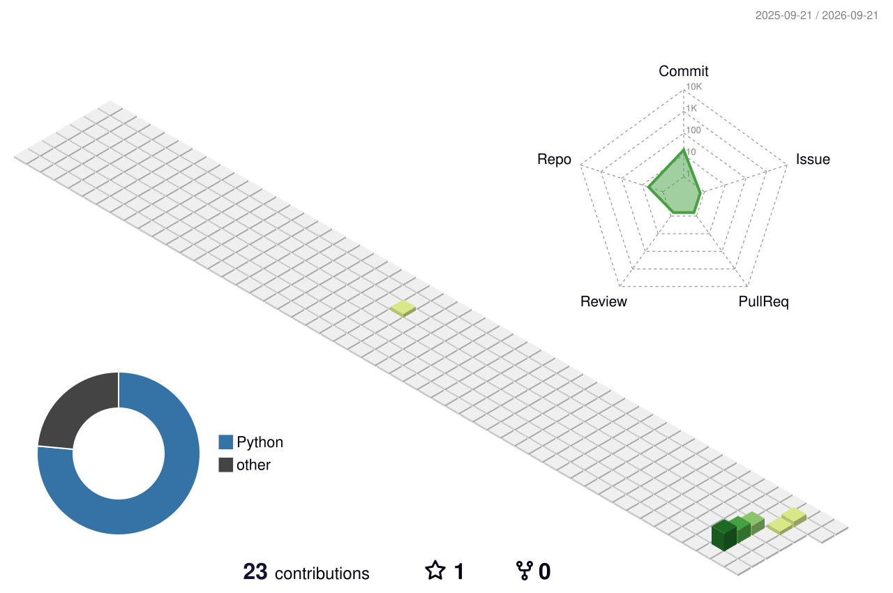

# 👋 Hi, I'm Karan

<div align="center">


</div>

---

## 🧑‍💻 About Me

I'm a developer focused on **Python, Web Development, AI/ML, and modern digital experiences**.

I enjoy turning ideas into real projects, learning new technologies, and continuously improving my development skills. 🚀

<div align="center">


</div>

---

## 🚀 What I Do

```text
🐍 Python Development
🌐 Web Development
🎨 UI & Creative Design
🤖 AI & Machine Learning
🗄️ SQL & DBMS
🐙 Git & GitHub
🚀 Real-World Projects
```

---

## 🛠️ Tech Stack

### 💻 Languages


### 🌐 Web Development


### 🔧 Tools


---

## ⚡ Currently Learning

<div align="center">


</div>

```text
🐍 Python
      ↓
🌐 Web Development
      ↓
🗄️ SQL & DBMS
      ↓
🤖 AI / Machine Learning
      ↓
🚀 Real-World Development
```

---

## 🚀 Featured Projects

### 🎯 Python Projects

* 🎮 **Quiz Game**
* 🔐 **Password Generator**
* 🎲 **Number Guessing Game**
* 📊 **Student Grade Management System**

### 🌐 Web Projects

* 🏋️ Business Websites
* 🍰 Bakery Websites
* 🏥 Clinic Websites
* 🍽️ Restaurant Websites
* 💼 Portfolio Websites

---

# 📊 GitHub Stats

<div align="center">


</div>

---

# 🔥 GitHub Streak

<div align="center">


</div>

---

## 🎯 My Goals

* 🚀 Become a strong **Python Developer**
* 🌐 Build professional websites
* 🤖 Develop skills in **AI & Machine Learning**
* 💼 Work on real-world projects
* 🧠 Keep learning new technologies
* 🛠️ Build a strong development portfolio

---

## 💡 My Philosophy

<div align="center">


</div>

---

<div align="center">

### 💻 Code • 🎨 Create • 🧠 Learn • 🚀 Build

**Thanks for visiting my profile! ⭐**

</div>
## 📊 My GitHub Contributions


